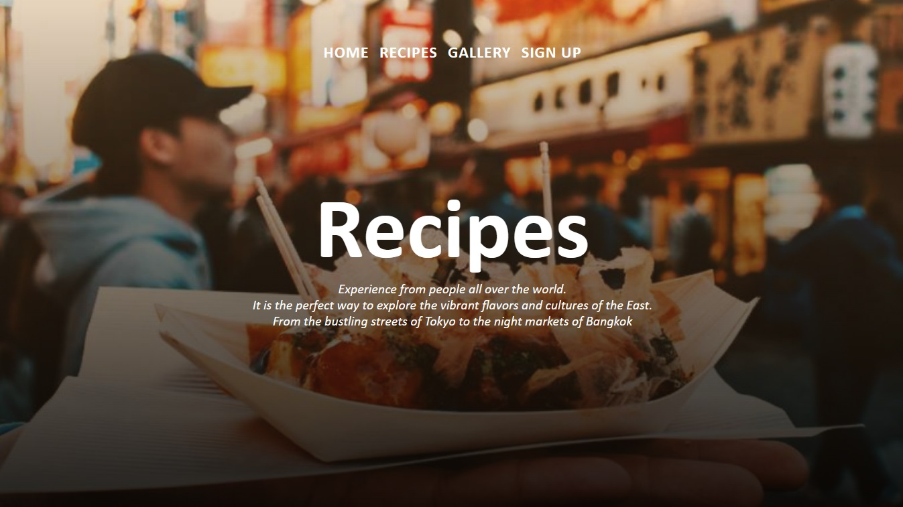

# ASIAN STREET FOOD

# Goal for this Project

This website is a place that showcases the range of amazingly good street food in Asia.
Let the viewers get inspiration to visit Asia, or if not, find recipes to cook at home for those who can't travel all the way there.


# Table of Contents
* [UX](#ux "UX")
    * [User Goals](#user-goals "User Goals")
    * [User Stories](#user-stories "User Stories")
    * [Site Owners Goals](#site-owners-goals)
    * [User Requirements and Expectations](#user-requirements-and-expectations)
         * [Requirements](#requirements)
         * [Expectations](#expectations)
     * [Design Choices](#design-choices)
        * [Fonts](#fonts)
        * [Icons](#icons)
        * [Colours](#colours)
    * [Features](#features)
        * [Existing Features](#existing-features)
            * [Navigation Bar](#navigation-bar)
            * [Landing Page](#landing-page)
            * [Article Section](#article-section)
            * [Sign Up Section](#signup-section)
            * [Latest Recipes Section](#latest-section)
            * [Footer](#footer)
            * [Recipe Page](#recipe-page)
            * [Gallery Page](#gallery-page)
        * [Features to be implemented](#features-to-be-implemented)
    * [Technologies used](#technologies-used)
        * [Languages](#languages)
        * [Tools and Libraries](#tools-and-libraries)
    * [Testing](#testing)
        * [Unfixed Bugs](#unfixed-bugs)
    * [Deployment](#deployment)
    * [Credits](#credits)
# UX

## User Goals
* Visually appealing, including images.
* Easily navigated around.
* Quality and valuable content.
* Easily found contact details.
* Form to directly contact the club.
## User Stories
* As a user, I want to know how asian street food looks like.
* As a user, I want get tips on where to go to experience different dishes
* As a user, I want to read about whats trending about street food in Asia.
* As a user, I want to be able to find recipes.
* As a user, I want to be able to easily navigate through the website.
* As a user, I want to be able to follow on social media.
* As a user, I want to be inspired to travel and enjoying Asian cuisine. 
## Site owners Goals
* Promote the webpage.
* Promote Asian street food.
* Increase the number of subsribers.
* Increase rankings on search engines.
### Requirements
* Easy to navigate.
* Clear information on the services provided.
* Keep the user interested with small bits of information to make them want to engage with the club.
* Simple methods of contacting the club.
* Visually inviting so users do not leave.
### Expectations
* I expect to know if a form has been submitted properly and if items are not filled in, to be prompted.
* I expect all links to social media sites to be opened in a new tab.
* I expect all navigation links to work correctly.
* I expect all information to be correct and accurate.

\
&nbsp;
[Back to Top](#table-of-contents)
\
&nbsp;

## Design Choices

### Fonts
For the main text I have chosen Gill Sans as I feel it is has a clear, simple and easy yet fun to read. Bold and Cursive has been used to elevate the text.

### Icons
I will used some icons for my website from the [Font Awesome library](https://fontawesome.com/ "Font Awesome"). These icons will only be used where there is no explanation needed to their meaning, social media links. All icons used will be styled and in keeping with the appearance of the website.

### Colours
I will be using a light gray-white colour on the background(#efefef) to make the website a little more soft looking, while the images will help making it feel warmer also. The text color used for headers is warm Red(RGB #170, 0, 0) and Black(#000000), while most of the paragraphs is using Black(#000000) and White(#ffffff). 

\
&nbsp;
[Back to Top](#table-of-contents)
\
&nbsp;


# Features

## Existing Features

### Navigation Bar

Navigation Bar
Featured on all three pages, the full responsive navigation bar links to the Homepage, Recipes, Gallery and Sign Up pages.
In order for the user to visably see which of the links they are hovering over, there is a text changing colour.


\
&nbsp;
[Back to Top](#table-of-contents)
\
&nbsp;

### Landing Page

The Landing page starts of with a big background image to show off the vibes from the amazing streets, colourful environment and delicious food. The Navbar is centered  above a big clear title(ASIAN STREET FOOD) and a small explanation below the title.


\
&nbsp;
[Back to Top](#table-of-contents)
\
&nbsp;


### Article Section

Here are some of the latest articles that shows news about street food in Asia. 
A button that would redirect to the whole article will be highlighted with hover effect by changing the appearence of the button. 


\
&nbsp;
[Back to Top](#table-of-contents)
\
&nbsp;

### Sign up Section

This page will allow the user to get signed up. The user need to fill in first name, last name and mailadress to be able to recieve weekly/dailly newsletter for recipes/articles.


A highlighting effect will show up when hover over the textbox and the "send" button.

Additional features could be creating an account along with the Sign Up form. In the Login account there will be rating function for each recipy, access to a library of recipes, saving all the favorites recipes as shortcuts.

\
&nbsp;
[Back to Top](#table-of-contents)
\
&nbsp;

### Latest Recipe Section

This section contains 8 of the latest recipe shortcuts on the mainpage.
Inviting images that when hovering over will animate gradient/transition effect with description of the dishes.
There will also be a go to "Full Recipe" button, redirecting to the full recipe page. 


\
&nbsp;
[Back to Top](#table-of-contents)
\
&nbsp;

### Footer

The footer contains the social media links. These social links all open in a new tab for ease of use to the user and also, so the user has an ability to easily come back to Asian street Food's site. There is also a hover effect over the links, again to improve user experiance.


\
&nbsp;
[Back to Top](#table-of-contents)
\
&nbsp;

### Recipe Page

When going to the Recipe page the navigation bar will have another background image to make the page interesting. 
4 columns and numerous row of images will be shown and once its hovered, it will show the same animation/transition as earlier. 
It contains a headline, text and a link to the full recipe.




\
&nbsp;
[Back to Top](#table-of-contents)
\
&nbsp;

### Gallery Page

This Gallery will provide the user with supporting images to see how the atmosphere on asian street market and street food looks like.

Additional features could be showing info about what it is, where its about. 
Link those images to peoples account/social media and read about their experince and travel all over the world. 


\
&nbsp;
[Back to Top](#table-of-contents)
\
&nbsp;


## Features to be Implemented

+ Contact form to send message to T4Tri instead of leading to a dummy page.
+ Links to club sponsors websites.
+ Add a shop for club clothing to be purchased.
+ Add a library of structured workouts for all activities.

\
&nbsp;
[Back to Top](#table-of-contents)
\
&nbsp;

# Technologies used

## Languages
* [HTML](https://en.wikipedia.org/wiki/HTML "HTML")
* [CSS](https://en.wikipedia.org/wiki/CSS "CSS")

## Libraries & Framework
* [Font Awesome library](https://fontawesome.com/ "Font Awesome")

## Tools
* [Gitpod](https://www.gitpod.io/ "Gitpod")
* [W3C HTML Validation Service](https://validator.w3.org/ "W3C HTML")
* [W3C CSS Validation Service](https://jigsaw.w3.org/css-validator/ "W3C CSS")
* [Font Awesome library](https://fontawesome.com/ "Font Awesome")
* [Google Fonts](https://fonts.google.com/ "Google Fonts")
* [RawPixel](https://www.rawpixel.com/ "RawPixel")
* [Box Shadow Generator](https://html-css-js.com/css/generator/box-shadow/ "html-css-js.com")

\
&nbsp;
[Back to Top](#table-of-contents)
\
&nbsp;

# Testing

I feel that the site has hit the goals required by all parties. The site responds nicely to all different screen sizes, the images look clean and sharp on all device sizes with very little, large blank spaces. It allows the user to navigate around easily and aslo make contact via the contact form or social media simply. It The content is simple and to the point and the site is not overcrowded as to put the user off.
\
&nbsp;

I have encountered several issues during testing. 
 + I initially decided to create the site with a minimum width of 992px as my largest styling, however the site just did not look right so added an x-large screen size.

 + In my wireframes, I had designed to only have a 'Join Us' button on the larger screen sizes. While I was developing the site, this did not make sence. There was such a long scroll with it being a one-page site, I felt I needed to speed up the movement for someone who was instantly interested so included it on all screen sizes.

 + On actual smaller devices, instead of on Chrome Developer, the main navigation menu did not show the 'Contact' link. I simply changed the styling of the links and the changed the ul to flex-start and all is now clearly visable.

 + I was having issues with the navigation bar scrolling about 15px when I scrolled down on smaller devices whilst working on Chrome Developer. I lost a lot of time trying to figure out the issue, but when I tried the site on an acual device, the navigation bar stayed fixed as the code dictated. This was a bug in Chrome Developer and not with my site.

 + The main navigation on smaller devices was initially set to 90vh, however on testing on a physical device, the user could see the site scrolling at the bottom if they were to slide up or down. This looked very poor and clumsy on the eye, so I adjusted it to 100vh to cover it up.

 + I found that I was repeating alot of code in my style.css file in order to center items. I created a class to do this and then applied it whee needed.

 + All my buttons were styled completly differently. I added an animation to all buttons so there is a continuity between them all.

 + When I was validating HTML code, I had one error showing. This was in the contact form where I had a method of '#'. I was under the understanding that POST method should have been used, but when I did, it caused an error instead of going to my contact.html page. After a while I tried using GET and it worked solving my validation problem. The results of my validation for HTML and CSS are below.

    - HTML (index.html) validator [results](wireframes/html-validate.JPG "W3C HTML")
    - HTML (contact.html) validator [results](wireframes/html-contact-validate.JPG "W3C HTML")
    - CSS validator [results](wireframes/css-validate.JPG "W3C CSS")
\
&nbsp;

 + On testing on a physical mobile device, I thought that the google search bar looked odd, being white and my header a dark colour. For user experiance and to make it look cleaner and more fluid, I changed the colour to match using the following code.

 ```

 <meta name="theme-color" content="#121A18">


 ```

 + When going through my UX section, to ensure that all my goals were met for the project, I noticed that I had missed one, 'As a user, I want to know that the club is well established'. I adjusted the text in the welcome section to suit.
\
&nbsp;

## Unfixed Bugs

My learning has limited my use of the hamburger for smaller devices. It works nicely to open the menu up, but a tap of the hamburger again should close the menu down again. It does not do this, and the link has to be selected to enable the user to exit out of it. From my research it seems that all the streamline methods are using JavaScript and I am yet to learn this.


\
&nbsp;
[Back to Top](#table-of-contents)
\
&nbsp;

# Deployment

Following writing the code then commiting and pushing to GitHub, this project was deployed using GitHub by the following steps.

+ Navigate to the repository on github and click 'Settings'.
+ Then select 'Pages' on the side navigation.
+ Select the 'None' dropdown, and then click 'master'.
+ Click on the 'Save' button.
+ Now the website is now live on https://sam-timmins.github.io/T4Tri-triathlon-club/
+ If any changes are required, they can be done, commited and pushed to GitHub and the changes will be updated.

\
&nbsp;
[Back to Top](#table-of-contents)
\
&nbsp;

# Credits

For code insperation, help and advice,
* [Simen Daehlin](https://github.com/Eventyret "Simen Daehlin")

\
&nbsp;

..................................................................
SVENSKA!!!!!!
Features Left to Implement

Testing

Validator Testing
HTML: No errors were returned when passing through the official W3C validator?
CSS:  No errors werre returned when passing through the oficial (Jigsaw) validator?

Deployment 

Credits

Content

Media

Future Progress
Lägga till ingredienser till recept


Projektbeskrivning?
Visa problem o lösningar
Bilder o Screenshots
Redovisa felsökning program
